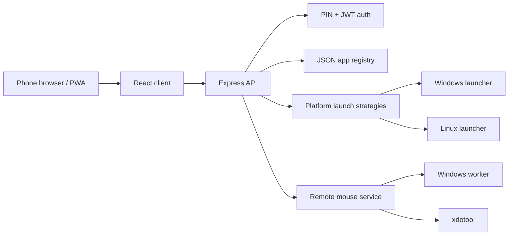

# PhoneDesk


PhoneDesk turns a phone into a polished local control surface for launching desktop applications and using the PC mouse remotely.

> Main application source: [`/phonedesk`](./phonedesk)

## Why it is ready for GitHub

- English-only UI and documentation
- Production-friendly repo cleanup and ignore rules
- Native file picker for quick app onboarding
- Smarter Windows app scanning focused on real user-facing apps
- Faster Windows mouse control through a persistent worker
- Health endpoint, CI workflow, contribution guide, and structured docs

## Quick start

```bash
cd phonedesk
npm ci
npm run build
npm start
```

Open the admin panel locally on your computer, then connect from your phone on the same network.

## Architecture



## Documentation

- [Project README](./phonedesk/README.md)
- [Installation guide](./phonedesk/docs/INSTALLATION.md)
- [Architecture notes](./phonedesk/docs/ARCHITECTURE.md)
- [Operations guide](./phonedesk/docs/OPERATIONS.md)
- [Security guide](./phonedesk/docs/SECURITY.md)
- [Contributing](./CONTRIBUTING.md)

## Repository note

Do **not** commit the live `data/` folder. It contains runtime state such as the generated PIN hash, app catalog, and audit log. Keep only `.gitkeep` or sample data if you need placeholders.
